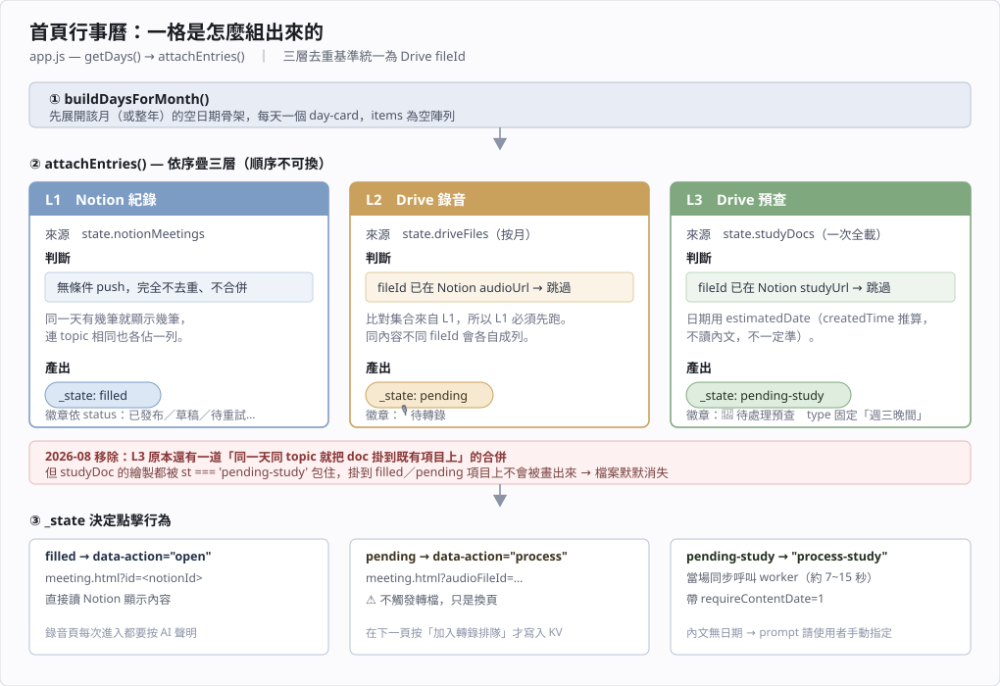

# 教會聚會紀錄系統 — 維護說明

給維護者（未來的自己或接手的人）。使用者操作請看 [使用說明.md](使用說明.md)。

---

## 1. 設計目標

依重要性排序。**後面的目標永遠不該犧牲前面的。**

### 1.1 教義安全 ＞ 一切

這是教會系統。AI 轉寫的內容如果被當成權威，錯一節經文就是教錯人。因此：

- 錄音頁**每次**開啟都強制顯示 AI 聲明，按確認才顯示內容（不記憶、不跳過）
- 紀錄預設狀態是「草稿」，校對後才由人改成「已發布」
- 系統**不做**任何「AI 判斷教義對錯」的功能

### 1.2 最終一致 ＞ 即時

教會不需要「按下去 30 秒內完成」。需要的是「丟進去以後**一定會**完成，不用一直盯著」。

因此所有轉檔都是**排隊 → 背景處理 → 自動重試**，而不是即時處理。使用者按完可以關掉網頁。

### 1.3 失敗必須看得見

比「不失敗」更重要的是「失敗的時候知道發生什麼事」。所有失敗都會在 Notion 留下條目 + 錯誤訊息，不會無聲消失。

### 1.4 零維運成本

全部跑在免費額度上（Cloudflare Workers Free、Gemini Free、Notion、GitHub Pages）。**大量的設計妥協都源自這一條**，見 §5。

### 1.5 長輩友善

大字版、深色模式、不需登入、手機優先。

---

## 2. 架構

```
┌─────────────────┐     ┌──────────────────────┐     ┌─────────────┐
│  GitHub Pages   │────▶│  Cloudflare Worker   │────▶│   Notion    │
│  (純靜態前端)    │     │  church-meeting-api  │     │ (資料真相源) │
│  liming-meeting │◀────│                      │◀────│             │
└─────────────────┘     └──────┬───────┬───────┘     └─────────────┘
                               │       │
                    ┌──────────▼─┐  ┌──▼──────────┐
                    │ Google     │  │  Gemini API │
                    │ Drive      │  │  (2.5-flash)│
                    │ (錄音/預查) │  └─────────────┘
                    └────────────┘
                               │
                    ┌──────────▼─────────────┐
                    │ CF KV: PROCESS_QUEUE   │
                    │ (手動排隊佇列)          │
                    └────────────────────────┘
```

| 元件 | 角色 | 位置 |
|---|---|---|
| 前端 | 純靜態 HTML/JS，無框架、無建置流程 | `index.html` `app.js` `meeting.html` `meeting.js` `api.js` `styles.css` |
| Worker | 所有後端邏輯（單檔 ~2,400 行）| `worker/src/index.js` |
| Notion | **唯一資料真相源**，同時是後台編輯介面 | Database「聚會紀錄」|
| Drive | 錄音與預查文件來源 | Service Account 存取 |
| KV | 手動排隊佇列 | `PROCESS_QUEUE` |
| Config Sheet | Gemini prompt 等可調參數（改完不用重新部署）| Google Sheet |

**關鍵設計決定：Notion 同時是資料庫和後台。** 不自建管理介面，同工直接在 Notion 校對、改狀態、改聚會類型。前端只讀不寫。

---

## 3. 運作原理

### 3.1 錄音轉檔（主流程）

```
使用者點「加入排隊」
   → POST /drive/queue?fileId=X
   → 寫入 KV: audio:{fileId}（TTL 7 天）
   → 回傳佇列位置

〔等待 cron：06:30 / 12:30 / 16:00 / 21:30 台北〕

cron 觸發 runDailyProcess()
   ├─ ① sweepAndRetryOne()  ← 優先處理重試（見 3.2）
   │     有做重試 → 本輪結束（一次 cron 只做一件重活）
   ├─ ② KV 佇列（每輪 1 份）
   ├─ ③ 自動掃描 Drive 未處理錄音（每輪 1 份）
   └─ ④ 預查自動處理（每輪 1 份）← 只有 ①②③ 都沒做事才走到

②③ 都走 processWithPlaceholder(env, fileId)：
   1. dedup：Notion 已有此 fileId 的紀錄 → 跳過
   2. 解析檔名 → 建立 Notion placeholder（狀態=處理中）
   3. processAudio(env, {fileId}, pageId)
   4. 失敗 → markForRetry(pageId, 1, 錯誤訊息) → 狀態=待重試 1/3
```

`processAudio` 內部：

```
Step 1  取 Drive metadata
Step 2  dedup（有 pageId 時跳過，caller 已檢查過）
Step 3  依檔案大小決定切割策略（不下載，只看 metadata.size）
Step 4  Gemini 分析
        ├─ 小檔（≤25MB）：整顆下載 → 一次 Gemini 呼叫
        └─ 大檔（>25MB）：三段式
             4a. Range 下載前 55% → Gemini brain dump   [狀態→AI 分析中（前半）]
             4b. Range 下載後 55% → Gemini brain dump   [狀態→AI 分析中（後半）]
             4c. 純文字整合成最終格式                    [狀態→整合中]
Step 5  寫入 Notion                                     [狀態→寫入內容 → 草稿]
```

**為什麼大檔要 Range 下載**：Worker 記憶體上限 128MB。113MB 的檔整顆讀進來再 `slice()` 切兩半會複製一份 → 直接爆掉。改成用 HTTP Range header 分別下載兩個區段，且用 block scope 讓前半段在後半段開始前可被 GC。

### 同一份錄音上傳多種格式 → 只轉一次

`listAllAudioCandidates()` 末端會過 `dedupeByBasename()`：**去掉副檔名後檔名相同的，只留一個**，優先序 `mp3 > m4a > aac > ogg > wav`。

為什麼需要：dedup 比的是 fileId，`.mp3` 和 `.wav` 是兩個 fileId → 兩個都會被轉，Notion 同一天冒出兩筆一模一樣的紀錄，各自燒掉一次 Gemini 額度；卡在「待重試」的還會持續佔用 cron sweeper 的名額。2026-08 清出 **19 組**這種重複（wav 通常是 mp3 的兩倍大）。

檔名已含日期＋講題＋講員，撞名幾乎不可能是兩場不同聚會，所以這個判斷很安全。

> **為什麼不直接刪 wav**：SA 對錄音資料夾唯讀，`trash-files` 會 403（見 §4.6）。而且錄音掃描是「副檔名 OR」跨整棵樹、**不看資料夾**，搬到子資料夾也擋不住 —— 只有 `trashed = false` 或掃描端過濾有效。

**為什麼重疊 10%**：切點可能剛好切在句子中間。前後段各取 55%（重疊 10%）讓 merge 階段有足夠上下文接合。

### 3.2 重試機制（cron sweeper 模式）

**這是整個系統最關鍵的設計，務必理解後再改。**

Cloudflare Free 的 `ctx.waitUntil()` 有時間上限。如果在**同一次背景任務內**重試 Gemini（等 4 秒再試），會把多次嘗試堆疊在同一份時間預算上 → 超時被 CF 中斷 → placeholder 卡死。而且 Gemini 過載通常持續**數分鐘**，等 4 秒根本救不回來。

所以：

| | 做法 |
|---|---|
| ❌ 不做 | 同一次任務內 retry（in-invocation retry）|
| ✅ 改做 | **fail-fast** + 交給**下一次 cron** 用全新 invocation 重跑 |

「全新 invocation」= 全新的時間預算 + 全新的 subrequest 額度 + 通常 Gemini 已經恢復。

```
sweepAndRetryOne(env)  ← 每次 cron 最先執行
  ① 偵測卡死
     條件：狀態 ∈ 處理中/下載中/AI 分析中.../整合中/寫入內容
          且 last_edited_time > 15 分鐘前
     → 判定為「背景任務被 CF 中斷」
     → 寫入超時記錄：「逾時：第N次嘗試卡在「XX」約 N 分鐘」
     → 標為 待重試 N/3

  ② 撈最舊的一個「待重試 1/3」或「待重試 2/3」

  ③ 重跑
     - 先把狀態改「處理中」+ 在「處理錯誤」記「第N次嘗試進行中」
       （這個標記是計數的持久化，見下方警告）
     - processAudio(env, {fileId}, pageId)
     - 成功 → 草稿
     - 失敗 → markForRetry(attempts+1) → 待重試 2/3 → 3 次滿 → 永久「失敗」
```

> ⚠️ **重試計數存在「處理錯誤」欄位的文字裡**（`第N次嘗試`）。因為被 CF 中斷時 code 沒機會執行，計數必須事先寫下來，否則卡死救援會把計數重設成 1，永遠到不了永久失敗。改動 `markForRetry` / sweeper 時務必保留這個機制。

**狀態機**：

```
處理中/下載中/AI 分析中… ──失敗──▶ 待重試 1/3 ──cron──▶ 待重試 2/3 ──cron──▶ 失敗
        │  │                                                              │
        │  └──卡死 15 分鐘──▶（同上，計數從標記還原）                        │
        │                                                                 │
        └──成功──▶ 草稿 ──人工校對──▶ 已發布                    人工按「重試」──┘
```

### 3.3 預查文件（週三查經）

```
listStudyDocs()  掃 DRIVE_STUDY_FOLDER_ID 底下的「子資料夾」（每本書一個）
   ⚠️ 父層直接放的檔案不處理
   ⚠️ 排除自產的 *_投影片.pdf（否則會被當成新預查無限循環）

processSingleStudyDoc(fileId, overwrite?, requireContentDate?, dateOverride?)
   1. extractDocText()
      - doc/docx/pdf → 複製成 Google Docs → export text/plain
      - ppt/pptx     → 複製成 Google Slides → export text/plain
      - 三種來源都再取得一份「完整文件」PDF（見下）
      - 暫存檔用 PATCH trashed:true 清除（共用雲端硬碟不能 DELETE）
   2. detectStudyDate()：內文前 12 行 → Drive description → createdTime→下個週三
   3. 純文字啟發式轉 Notion blocks（不經 Gemini）
   4. 寫入 Notion（type 固定「週三晚間」）
```

**預查不經過 AI**，是純文字轉換，所以沒有 AI 聲明閘門。

### 預查的自動處理（cron 步驟 ④）

`processOneNewStudyDoc(env)`，一輪 cron 最多做一份。

> ⚠️ **只在 `processed === 0` 時執行** —— 也就是本輪完全沒做錄音重活。
> 錄音約 33 subrequest、預查約 30，相加會撞破 free tier 的 50/invocation。
> **錄音永遠優先，改動 `runDailyProcess` 時務必保留這個守衛。**

兩個限制條件：

| 條件 | 常數 | 為什麼 |
|---|---|---|
| 只撿 14 天內上傳的 | `STUDY_AUTO_MAX_AGE_DAYS` | 舊檔是整批搬進 Drive 的，createdTime 全部相同（131 份的推估日期全是 2026-04-08），自動處理會集體堆到同一天 |
| 一律 `requireContentDate=true` | — | 日期只能靠 createdTime 時直接拒絕。被拒的留在待處理清單，由人在 index 點擊、手動指定日期 |
| 最多查 3 份的 dedup | `STUDY_AUTO_MAX_CHECKS` | 控制 subrequest |

**使用者要配合的事**：新的預查文件請在**內文前 12 行寫上聚會日期**，否則不會被自動撿走（會被 `requireContentDate` 擋下），仍需人工處理。

### 「完整文件」PDF（`投影片` 屬性）

**為什麼需要**：`export text/plain` 只抽得到文字，**圖片裡的字一律抽不到**（圖表、事件地圖、掃描頁）。純文字寫進 Notion 會缺內容，所以每篇都附一份 PDF，前端嵌 Drive 的 **PDF 預覽**（連續直向捲動，整份攤開）。不能用 PPT 預覽——那是翻頁式的。

| 來源 | 取得方式 | 成本 |
|---|---|---|
| `.pdf` | **直接沿用原檔 fileId**，不轉檔 | 0 subrequest、0 空間 |
| `.pptx/.ppt` | 暫存 Google Slides → export PDF | +3~4 subrequest |
| `.docx/.doc` | 暫存 Google Docs → export PDF | +3~4 subrequest |

> ⚠️ **10MB fallback 端點依型別而異**：官方 export API 超過 10MB 會失敗，`exportPreviewPdf()` 改打 `docs.google.com`——Slides 用 `/presentation/d/<id>/export/pdf`，Docs 用 `/document/d/<id>/export?format=pdf`。用錯只有在大檔時才會炸，是間歇性的坑。

**產出位置**：`<書卷資料夾>/_轉檔產出/<原檔名>_投影片.pdf`，子資料夾由 `ensureChildFolder()` 自動建立（已存在就沿用）。建不出來時退回來源資料夾，不致命。

> ⚠️ **防止自產 PDF 被當成新預查的兩道防線，改動時必須同步：**
>
> 1. `scanStudyFolder()` —— 遇到名為 `_轉檔產出`（常數 `STUDY_OUTPUT_FOLDER`）的子資料夾直接 `continue`，不遞迴
> 2. `isStudyFile()` —— 檔名符合 `/_投影片\.pdf$/i` 一律排除
>
> 任一道成立就擋得住。**若要改自產檔名或資料夾名，兩處都要改**，否則自產 PDF 會被掃成新預查 → 處理它又產生新 PDF → 無限循環。
>
> 副作用：`_轉檔產出` 整個資料夾不掃描，真正的預查文件誤放進去會被靜默忽略。

### 3.4 檔名解析

**錄音** `parseFilename()`：

```
/^(\d{4})-(\d{2})-(\d{2})\s*(.+?)\s*[（(]([^）)]+)[）)]\.(mp3|m4a|wav|ogg|aac)$/i
                            ↑↑                ↑
              日期後空白可省（舊檔常沒有）   全形/半形括號都吃
```

聚會類型由**星期幾**決定；週六再依 Drive `createdTime` 的台北小時分上午（<14）/下午。週一、週四回 `null` → `parseable=false` → 前端過濾掉。

**預查** `parseStudyFilename()`：優先比對 Config Sheet 的 `KNOWN_SPEAKERS`（最長優先），其次用 `_` 分隔取最後一段中文。會去掉開頭流水號（`17.主題_講員` → `主題_講員`）。

### 3.5 前端



#### 首頁 `app.js` — 行事曆一格是怎麼組出來的

`getDays()` 先用 `buildDaysForMonth()` 展開空的日期骨架，再由 `attachEntries()` 依序疊三層。**順序不可換**。

| 層 | 來源 | 判斷 | `_state` | 徽章 |
|---|---|---|---|---|
| **L1** | Notion 紀錄 | **無條件 push**，不去重也不合併 | `filled` | 依 status（已發布／草稿／待重試…）|
| **L2** | Drive 錄音 | fileId 已在 Notion `audioUrl` → 跳過 | `pending` | 🎙 待轉錄 |
| **L3** | Drive 預查 | fileId 已在 Notion `studyUrl` → 跳過 | `pending-study` | 📖 待處理預查 |

**三層的去重基準統一是 Drive fileId。** 只要 fileId 不同就各自佔一列，列表不會藏東西。

順序不可換的原因：**L2／L3 的比對集合是從 L1 已載入的 Notion 資料建出來的**（解析 `audioUrl` / `studyUrl` 裡的 fileId）。L1 沒先跑，去重就整個失效，同一場會出現「已轉檔」+「待轉錄」兩筆。

> **2026-08 移除的邏輯**：L3 原本在 fileId 去重之後，還有一道「同一天同 topic 就把 doc 掛到既有項目上」的合併（`existing.studyDoc = doc`）。
>
> 但所有 `studyDoc` 的繪製都被 `st === 'pending-study'` 包住（`renderCalendarEvent` / `renderWeekEvent` / `renderRow` 三處皆是），掛到 `filled` 或 `pending` 項目上**根本不會被畫出來** —— 沒有連結、沒有按鈕，等於默默吃掉一份未轉檔文件。topic/speaker 的 `studyDoc` 備援也救不了：既然是 topic 相同才合併，那個項目本來就有 topic。
>
> **不要再加回這種「用 topic 猜關聯」的合併。** 一份還沒轉檔的預查文件跟系統裡任何東西都沒有 ID 連結（Notion 只在轉檔完成後才存 fileId），沒有可靠的比對依據。

#### `_state` 決定點擊行為

| `_state` | `data-action` | 行為 |
|---|---|---|
| `filled` | `open` | → `meeting.html?id=<notionId>`，直接讀 Notion |
| `pending` | `process` | → `meeting.html?audioFileId=…`　⚠️ **不觸發轉檔**，只是換頁；在下一頁按「加入轉錄排隊」才寫 KV |
| `pending-study` | `process-study` | 當場同步呼叫 worker（7~15 秒），帶 `requireContentDate=1`；內文無日期時 `prompt()` 請使用者指定 |

#### 資料載入時機的差異

- **L2** `listUnprocessed(year, month)` —— 按月抓，有 5 分鐘 sessionStorage 快取（`DriveCache`）
- **L3** `listStudy()` —— **一次抓全部**，因為預查的日期是估的，不能按月查

#### 詳細頁 `meeting.js`

- `?id=<notionId>` → 讀 Notion 顯示
- `?audioFileId=X&...`（無 processing）→ 待轉檔頁，可試聽 + 加入排隊
- 處理中狀態 → **5 秒**輪詢；待重試 → **60 秒**輪詢；終態 → 停止
- 輪詢比對**優先用 fileId**（`studyFileId` / `audioFileId`），沒有才回退 date+type —— 所以同一天有兩筆也能精準找到對的那筆
- 音訊播放器走 `/audio` 代理

> **為什麼音訊要代理**：Drive 公開連結回應 `Cross-Origin-Resource-Policy: same-site`，瀏覽器在 CORS 之前就擋掉跨站 `<audio>` 載入（設 `Access-Control-Allow-Origin: *` 也沒用，CORP 是不同層的檢查）。Worker `/audio` 用 SA 取檔並透傳 Range，自己控制標頭。原本的 iframe 預覽不受影響是因為 iframe 走頁面嵌入路徑，不是 fetch 資源。

---

## 4. 部署與設定

### 4.1 部署

```bash
# Worker（路徑相對於 repo 根目錄 liming-meeting/）
cd worker
npx wrangler deploy

# 前端（GitHub Pages 自動部署）
cd ..
git add . && git commit -m "..." && git push
```

> ⚠️ **worker 原始碼在 repo 的 `worker/` 子目錄，跟前端同一個 git repo。** 早期 worker 沒進 git，曾發生兩台裝置各自改、Dashboard 版本互相覆蓋。**動手前一定先 `git pull`。**

### 4.2 Secrets（`npx wrangler secret put <NAME>`）

| Secret | 用途 |
|---|---|
| `SERVICE_ACCOUNT_KEY` | Google SA JSON 全文（Drive + Sheets）|
| `NOTION_TOKEN` | Notion Integration Token |
| `NOTION_DATABASE_ID` | 聚會紀錄 Database ID |
| `GEMINI_API_KEY` | Gemini API Key |
| `DRIVE_FOLDER_ID` | 錄音資料夾 |
| `DRIVE_STUDY_FOLDER_ID` | 預查父資料夾 |
| `ALLOWED_ORIGIN` | （選）CORS 來源 |

### 4.3 `wrangler.toml`

| 設定 | 目前值 | 說明 |
|---|---|---|
| `GEMINI_MODEL` | `gemini-2.5-flash` | **刻意寫死版本**，不用 `*-latest`（alias 曾指到區域未部署的版本回 503）|
| `QUOTA_PER_RUN` | `1` | 每次 cron 處理幾份，見 §5.1 |
| `crons` | `30 22`, `30 4`, `0 8`, `30 13`（UTC）| 台北 06:30 / 12:30 / 16:00 / 21:30 |
| `PROCESS_QUEUE` | KV binding | 手動排隊佇列 |

> Cloudflare Free 方案的 cron 上限：官方文件與 API 錯誤訊息都寫「5 個」，但**實測設 5 個仍會被拒**（`code 10072`），4 個才成功。**實際可用上限請當作 4。**
>
> 另外 `wrangler deploy` 若 cron 超限，會出現「程式碼上傳成功、但 triggers 部署失敗」的**半成功**狀態，錯誤訊息只說 "A request to the Cloudflare API ... failed" 不會講原因。要看真正原因得直接打 API：
>
> ```bash
> curl -X PUT "https://api.cloudflare.com/client/v4/accounts/<ACCOUNT_ID>/workers/scripts/church-meeting-api/schedules" \
>   -H "Authorization: Bearer <TOKEN>" -H "Content-Type: application/json" \
>   -d '[{"cron":"30 22 * * *"},{"cron":"30 4 * * *"},{"cron":"0 8 * * *"},{"cron":"30 13 * * *"}]'
> ```
>
> （token 可從 `~/.wrangler/config/default.toml` 的 `oauth_token` 取得）

### 4.4 Config Sheet（改完 5 分鐘內生效，不用重新部署）

| Key | 用途 |
|---|---|
| `gemini_system` | System instruction（強制繁中等）|
| `gemini_prompt` | 小檔單次分析的 prompt |
| `gemini_split_front_prompt` | 大檔前半段 brain dump |
| `gemini_split_back_prompt` | 大檔後半段 brain dump |
| `gemini_split_merge_prompt` | 兩段整合成最終格式 |
| `gemini_split_summary_prompt` | 前/後 prompt 未設定時的 fallback |
| `split_threshold_mb` | 切割閾值，預設 25 |
| `split_overlap_pct` | 重疊比例，預設 10 |
| `KNOWN_SPEAKERS` | 已知講員清單（預查檔名解析用）|

### 4.5 Notion Database 屬性

| 屬性 | 型別 | 寫入者 |
|---|---|---|
| 聚會主題 | Title | 系統 |
| 聚會日期 | Date | 系統 |
| 聚會類型 | Select | 系統（人工可改）|
| 狀態 | Select | 系統 + 人工 |
| 講員 | Text | 系統 |
| 簡易重點 / 完整重點 / 參考經文 / 聚會資訊 | Text | 系統 / 人工 |
| 錄音檔連結 / 預查資料連結 / 附件資料夾 | URL | 系統 |
| 投影片 | URL | 系統（PPT 專用）|
| 處理錯誤 | Text | 系統（**同時是重試計數的持久化載體**）|
| 轉檔時間 / 轉檔耗時 | Date / Text | 系統 |

「狀態」的 Select 選項系統會自動新增。

**dedup 的依據兩條 pipeline 不一樣，這點很容易搞混：**

**全部以 fileId 為準**（2026-08 統一，見下方沿革）：

| 位置 | 依據 | 程式碼 |
|---|---|---|
| 錄音（worker） | fileId（比對「錄音檔連結」）| `processWithPlaceholder` |
| 預查 `/study/process`（worker） | fileId（比對「預查資料連結」）| `isStudyAlreadyProcessed(env, file.id)` |
| 預查 `/study/sync` 批次（worker） | fileId | `isStudyAlreadyProcessed(env, doc.id)` |
| 預查 `overwrite=1` 封存 | fileId | `findStudyPageIdsByFileId(env, file.id)` |
| 前端 L2 / L3 | fileId（比對 `audioUrl` / `studyUrl`）| `attachEntries()` |

> **沿革（2026-08）**：`/study/process` 原本用「日期 + 聚會類型」去重，假設「每週三只會有一場」。但預查文件內文日期打錯時會撞到**別週**已存在的紀錄而被靜默擋下；又因為**預查失敗不建 placeholder**（跟錄音不同），Notion 完全不留痕跡，使用者看到的只是「按了沒反應」，無從診斷。已改為與批次一致的 fileId 去重。
>
> 連帶把 `overwrite=1` 的封存也從 `findNotionPageIds(date, type)` 換成 `findStudyPageIdsByFileId(fileId)` —— 否則同一天並存兩筆預查時，覆蓋其中一份會**連坐封存另一份**。
>
> `isNotionAlreadyProcessed()` 因此成為死碼，暫時保留。

### 撞日期時的行為（改動後）

同一天可以並存多筆預查，**行事曆會照實顯示兩筆**（前端 L1 是無條件 push，沒有合併邏輯）。這是刻意的 —— 讓錯誤看得見，再由人到 Notion 手動改日期，符合 §1.3。

### ⚠️ `requireContentDate` 只用在 cron，手動點擊不用

`GET /study/list` **不讀內容**，`estimatedDate` 一律是 `getNextWednesdayTaipei(createdTime)`（`handleStudyList`）。而多數舊檔是**同一天整批搬進 Drive** 的，createdTime 全部相同 —— 截至 2026-08 有超過 **100 份待處理預查的 estimatedDate 全是 `2026-04-08`**。

| 路徑 | `requireContentDate` | 為什麼 |
|---|---|---|
| **cron 自動**（`processOneNewStudyDoc`）| **`true`** | 無人看管。日期不可信時集體堆到同一天沒人會發現，被拒的留在待處理清單等人工 |
| **手動點擊**（`api.js` `processStudy()`）| **不帶** | 使用者當下就在現場。一律先轉，日期不準就進 Notion 改「聚會日期」 |

> **曾經試過但拿掉的做法**：前端預設帶 `requireContentDate=1`，被拒時用 `prompt()` 請使用者輸入日期。問題是
> ① `prompt()` 在手機上體驗很差，長輩用不了；
> ② 拒絕發生在 `extractDocText()` **之後**（要先抽完文字才知道內文有沒有日期），使用者得空等 15~20 秒才看到對話框，看起來像當掉。
>
> 既然 Notion 本來就是真相源、日期在那邊一鍵可改，先轉進去再修才是實際的做法。

### 診斷 SOP

```bash
# ① 這份檔案系統認為是哪天、有沒有已存在的紀錄
curl -s ".../study/list"  | grep <檔名關鍵字>
curl -s ".../meetings"    # 找該日期的「週三晚間」

# ② 確認正確日期後指定寫入
curl -X POST ".../study/process?fileId=<ID>&date=YYYY-MM-DD"

# ③ 若要取代這份檔案自己的舊紀錄
curl -X POST ".../study/process?fileId=<ID>&date=YYYY-MM-DD&overwrite=1"
```

### 4.6 API 端點

| 路徑 | 用途 |
|---|---|
| `GET /meetings` | 列出全部聚會（前端首頁）|
| `GET /meetings/:id` | 單一聚會 + 內文 blocks（自動分頁）|
| `GET /drive/list?year=&month=` | 某月 Drive 錄音 |
| `POST /drive/queue?fileId=` | 加入 KV 排隊（**正常手動流程**）|
| `POST /drive/process?fileId=` | 即時處理（只剩失敗頁「重試」鈕用）|
| `GET /study/list` | 列出預查文件 |
| `POST /study/process?fileId=&overwrite=&date=&requireContentDate=` | 處理單篇預查 |
| `POST /study/sync?limit=` | 批次處理預查 |
| `POST /study/cleanup` | 清 `_temp_study_*` 殘留 |
| `GET /audio?fileId=` | 音訊代理（支援 Range）|
| `POST /admin/run-daily?limit=` | 手動觸發 cron 邏輯 |
| `POST /admin/archive?pageId=` | 封存 Notion 頁 |
| `POST /admin/rename-files` | 批次改檔名（body `[{fileId,name}]`，一次 ≤40）|
| `POST /admin/move-to-subfolder` | 搬進 `<父資料夾>/<底線開頭名稱>/`，只改 parents |
| `POST /admin/trash-files` | 丟 Drive 垃圾桶（PATCH `trashed:true`，可還原）|

後三個都需要 `apply=1` 才會實際執行，否則只回報計畫。

> ⚠️ **`/admin/*` 沒有任何驗證**。知道網址就能觸發（會燒 Gemini 額度）。已知風險，目前接受。

> ⚠️ **Service Account 的寫入權限不對稱**：預查資料夾樹**可寫**（能建 `_轉檔產出`、改檔名、上傳 PDF）；**錄音資料夾唯讀** —— `trash-files` 對錄音檔會回 403。錄音端的重複只能從掃描端過濾（見 §3.1 `dedupeByBasename`）。

---

## 5. 免費額度限制（多數設計妥協的來源）

### 5.1 Cloudflare Workers Free

| 限制 | 影響 | 因應 |
|---|---|---|
| **50 subrequest / invocation** | 每份錄音約用 25–30 個，cron 前置作業約 8 個 → 第 2 份必爆 | `QUOTA_PER_RUN=1`，一次 cron 只做一份 |
| **`waitUntil` 時間上限** | 長時間背景任務被中斷 → placeholder 卡死 | fail-fast + cron sweeper 重試（§3.2）|
| **128MB 記憶體** | 大檔整顆載入會爆 | Range 分段下載 |
| cron 數量上限（文件寫 5，**實測只能 4**）| 一天最多 4 個時段 | 目前用 4 個，已達上限 |

> `fetch` 的 `waitUntil` 比 `scheduled` handler 更容易被砍——前者是「回應送出後的剩餘時間」，後者是專門的背景執行容器。這就是為什麼**手動即時處理不穩、cron 穩**，也是把主流程改成排隊的根本原因。

### 5.2 Gemini Free

- 每日請求數有限（實務上約 20 次）
- 每份錄音：小檔 1 次、大檔 3 次（前半 + 後半 + 整合）
- **每天下午 3 點（太平洋午夜）重置**
- 常見錯誤：`This model is currently experiencing high demand`（503，尖峰時段）

一天 4 次 cron × 1 份 ≈ 12 次呼叫，約用掉 60% 額度。

---

## 6. 常見維護情境

### 加新的聚會類型

`TYPE_TIMES` 加時段 → `parseFilename()` 加判斷。**或者**更簡單：不改 code，直接在 Notion 手動改該筆的「聚會類型」（前端顯示的是 Notion 的值，不是 worker 算的值）。

### 調整 AI 輸出風格

改 Config Sheet 的 prompt，5 分鐘內生效，不用部署。

### 大量重跑歷史資料

```bash
curl "https://church-meeting-api.c3012312.workers.dev/study/process?fileId=X&overwrite=1&date=2026-06-17"
```

`overwrite=1` 會封存**同 fileId** 的舊紀錄再建新的。`requireContentDate=1` 可防止日期偵測退化到不可信的 `createdTime`（搬過檔的資料夾 createdTime 全部相同，非常危險）。

> ⚠️ **換檔重傳（新 fileId 取代舊檔）時，`overwrite=1` 抓不到舊紀錄**（fileId 不同），會變成同一天兩筆。要先 `/study/process?fileId=新&date=舊日期` 再 `/admin/archive?pageId=舊`。

### 批次補齊整卷歷史預查（2026-08 實作，創世記 90 份 + 出埃及記 10 份）

搬檔進來的舊資料 `createdTime` 全部相同（例如全是 `2026-04-08`），真實日期可能差好幾年。可行的流程：

**① 先整理檔名，再轉檔**
topic / speaker 是從檔名解析的，轉完再改名就得重跑。用 `/admin/rename-files` 統一成 `<書卷>第N章M-M預查_講員.ext`。

解析器的坑：`出35預查黃執事.docx` 會把「預查黃執事」整串當講員（規則「結尾 N 字中文＋職稱」誤命中），**加底線** `出35預查_黃以諾執事.docx` 就對了。

**② 第一輪：全部帶 `requireContentDate=1`**
有內文日期的自動拿到正確日期；沒有的被拒絕、**不寫入**，成為第二輪的清單。創世記 90 份中有 37 份（41%）拿得到。

**③ 驗證「章節順序＝時間順序」**
把已知日期依「章＋起始節」排序，檢查是否遞增。創世記 0 逆序 → 可安全內插；出埃及記有 2 個逆序（一次臨時調課、一次檔名排序問題）→ 改用下面的方法。

**④ 第二輪：補上剩下的日期**

| 情境 | 方法 | 實測誤差 |
|---|---|---|
| 錨點稀疏、順序單調 | **線性內插**（依排序位置）＋貼齊最近的週三 | 留一驗證：91% ≤1 週、100% ≤2 週、中位數 7 天 |
| 待補的每一份都有「同章錨點」 | **直接抄同章那筆的日期** | 精準，且不受順序逆轉影響 |
| 兩者皆不適用 | `2026-01-01`，由人在 Notion 調 | — |

> 出埃及記 58 份塞進 48 個週次 → 10 週是一週兩份，所以「同章對齊」才是對的解法；用內插反而會被 35/36 章的順序逆轉騙到。

**⑤ 批次呼叫的注意事項**
Drive 的 copy API 密集呼叫時會回 **403，訊息是「permissions」但其實是速率限制**。間隔拉到 1.5 秒以上並加退避重試（第一輪就有 2 份誤判為權限問題，重試即成功）。

### 看 log

Cloudflare Dashboard → Workers & Pages → church-meeting-api → **Observability → Logs**（保留約 3 天）。

即時：`npx wrangler tail`

---

## 7. 已知限制 / 技術債

| 項目 | 說明 | 嚴重度 |
|---|---|---|
| `/admin/*` 無驗證 | 知道網址即可觸發，會燒額度 | 中（已知接受）|
| worker 單檔 2,400 行 | 可拆模組，但沒有拆的急迫性 | 低 |
| `app.js` 三份重複渲染邏輯 | `renderCalendarEvent` / `renderWeekEvent` / `renderRow` 幾乎相同，改狀態要改三處 | 低 |
| 排程時間寫死在前端兩處 | `meeting.js` 的說明文字與 `getNextScheduleTime()`，改 cron 要同步改 | 低（曾經漂移過）|
| `/meetings` 回傳全部欄位 | 目前 ~400 筆約 300KB+，規模長大後首頁會變慢 | 中（筆數持續成長）|
| `app.js` 有死碼 | `handleProcess()` 已無呼叫端（手動流程改走排隊）| 低 |
| 掃描型 PDF 無法抽文字 | Drive OCR 不一定觸發 | 低（本質限制）|
| 週一 / 週四不支援 | `parseFilename` 回 null | 低（教會無此聚會）|
| **PDF 轉檔後段落順序可能錯亂** | PDF→Google Docs 轉換會重排文字流，段落互相穿插（內容不會遺失，只是順序亂）。也因此**不能**做「句尾沒標點就跟下一行合併」的斷行修復 —— 會把不相干的句子黏起來，錯得更隱蔽 | 中（本質限制，看「完整文件」PDF 即可）|
| **`isNotionAlreadyProcessed()` 是死碼** | 預查去重改用 fileId 後就沒有呼叫端了 | 低 |
| 預查失敗不留痕跡 | 跟錄音不同，沒有 placeholder。前端已改成 alert 顯示原因，但 Notion 端仍無紀錄 | 低（已有前端補償）|

---

## 8. 給接手者的三個提醒

1. **先 `git pull` 再動手。** worker 在 git 裡了，但 Cloudflare Dashboard 仍可直接編輯線上版本。兩邊都改過就會互相覆蓋。

2. **不要「順手加 retry」。** 看到 Gemini 503 的第一直覺是加重試，但在同一次背景任務內重試會讓 `waitUntil` 超時被砍，結果更糟。重試的正確位置是 cron sweeper（§3.2）。這個坑踩過了。

3. **Notion 是真相源，不是快取。** 系統的狀態機、dedup、重試計數全都存在 Notion 屬性裡。改 Notion schema（尤其「狀態」和「處理錯誤」）前先確認影響範圍。
